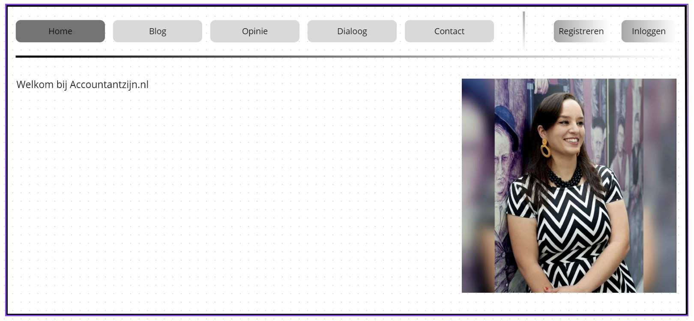
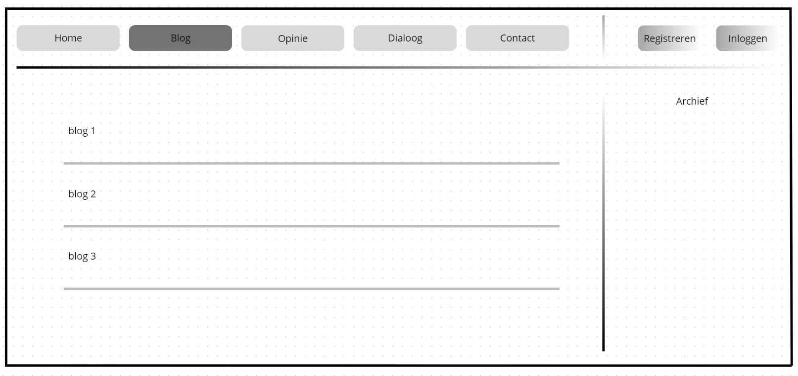
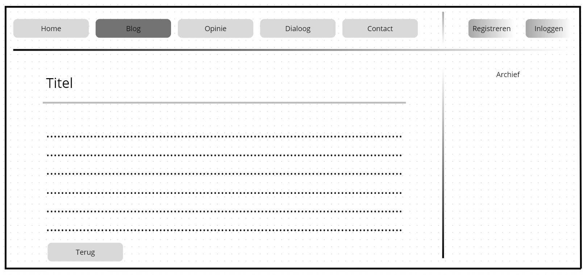
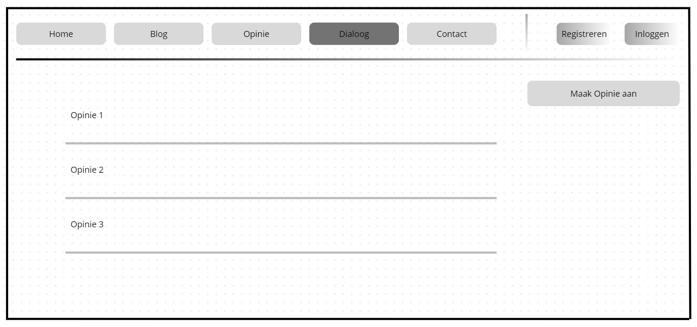

# <u>Inleiding</u>
Accountantzijn.nl moet het go to platform worden voor dialoog omtrent finance vraagstukken en mogelijke samenwerking bij
het tackelen van deze vraagstukken. Accountantzijn.nl is informatief en interactief en is zo ingericht dat de belangrijkste
vraagstukken boven komen drijven. Het brengt vraagstukken en oplossers bij elkaar.

### Wat is het probleem?
Er ontbreekt een online interactief platform voor accountants om discussies te kunnen voeren over veranderingen en koers binnen het vakgebied.

### Wie zijn de verwachte gebruikers?
De accountant en het maatschappelijk verkeer.

### In welke setting wordt het project gebruikt?
Deze website is bedoeld om te gebruiken op verschillende formaten desktops en laptops.

### Wat doet deze oplossing anders of beter dan bestaande oplossingen?
Voor zover bekend zijn er geen andere websites waar accountants op deze manier interactief met elkaar kunnen discussiëren over ontwikkelingen en koers binnen het vakgebied.

### <u>Website schets:</u>

#### Homepage:

#### blog:

#### blog drill through

#### opinie:

#### dialoog:

#### dialoog drill through:

# Dankbetuiging

Ik wil de volgende projecten bedanken voor het vrij beschikbaar stellen van code/koppelingen/platform:

1. Flask en Jinja van het Pallets-team:  
   Flask en Jinja worden gebruikt als webframework voor de webaplicatie.

2. TinyMCE – Rich Text Editor:  
   De gratis versie van TinyMCE wordt gebruikt als teksteditor voor het schrijven en bewerken van blogartikelen.

3. Bootstrap CSS van MIT:  
   Er worden CSS classes gebruikt uit het Bootstrap-framework van MIT voor Buttons form control etc.

3. De dialoogfunctionaliteit is geïnspireerd op het Microblog-project van Miguel Grinberg (MIT-licentie, GitHub: miguelgrinberg/microblog).  
   [https://github.com/miguelgrinberg/microblog/tree/main/app](https://github.com/miguelgrinberg/microblog/tree/main/app)  
   [https://blog.miguelgrinberg.com/post/implementing-user-comments-with-sqlalchemy](https://blog.miguelgrinberg.com/post/implementing-user-comments-with-sqlalchemy)

4. eerste filter:  
   [https://github.com/SwastikGowdaL/Mod-Guard](https://github.com/SwastikGowdaL/Mod-Guard)

5. LLM:  
   [https://github.com/SalesforceAIResearch/BingoGuard](https://github.com/SalesforceAIResearch/BingoGuard)

